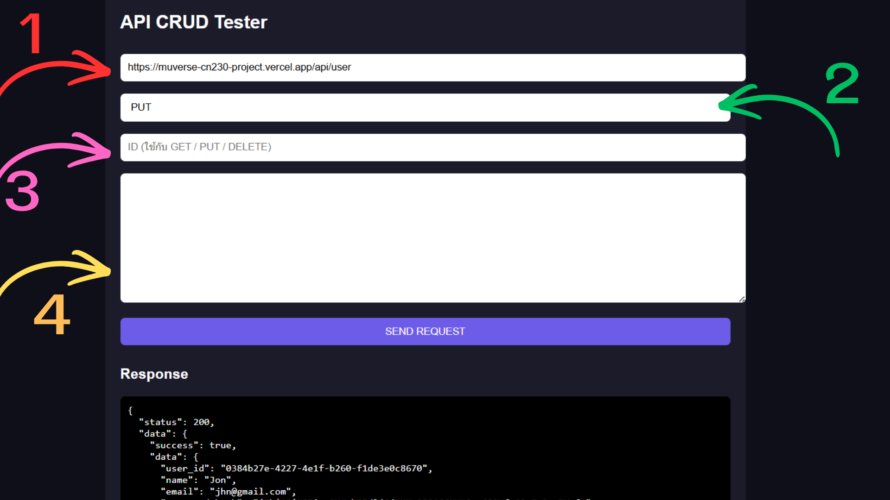

# CN230 MUVERSE
ระบบฐานข้อมูลสำหรับวิชา CN230
---
**Tech Stack:** Node.js · Express · PostgreSQL (Neon) · HTML/CSS/JS · Vercel
---

## WEBSITE
https://muverse-cn230-project.vercel.app/

---
### ไฟล์สำหรับ copy และ แก้ไข อยู่ใน folder แล้ว

## โครงสร้างที่เราจะแก้ไขกันนะเตง

```
muverse/
├── src/
│   ├── index.js               # Entry point (import only) สร้าง server
│   ├── config/
│   │   ├── db.js              # Neon database
│   │   └── paths.js           # Static file paths
│   ├── models/
│   │   ├── aModel.js          #ตัวอย่าง การเขียน
│   │   └── usersModel.js       
│   ├── controllers/
│   │   ├── aController.js     #ตัวอย่าง การเขียน
│   │   └── userController.js  
│   ├── routes/
│   │   ├── aRoutes.js         #ตัวอย่าง การเขียน
│   │   ├── usersRoutes.js     
│   │   └── pageRoutes.js
│   └── middleware/
│       └── errorHandler.js
├── public/
---
```
## PUSH GIT

```bash
npm git add .
```
```bash
npm git commit -m "เลขversion"
```
```bash
npm git push origin main
```
---
## Extensions vscode
แนะนำให้ติดตั้ง ทุกตัวนะจั๊บ
```
Ruff
```
```
Colorize
```
```
HTML CSS support
```
```
Indent-rainbow
```
```
Live server
```
---
## Testing API
```
muverse/
└── test_api/
     └── testAPI.html 
```

กดเข้าfolder muvesre/test-api/testAPI.html 
คลิ้กขวาที่ไฟล์ testAPI.html  บนสุดจะมีคำว่า open with live server 
กดเข้าไปเลย แล้วจะขึ้นหน้าเว็บ


## * ต้องใส่ Extensions แล้วเท่านั้น * 

---

1. API ที่จะเทส
```
https://muverse-cn230-project.vercel.app/api/<ชื่อ api เทส>
```
2. ประเภท API เป็น get post put delete ใส่เอาคิดเอา จะเทสตัวไหน

3. ID กรณีเทสตัว BY id ต่างๆ 

4. json ไฟล์ ดูว่าถ้า api นี้ต้องใส่ req body ก็ใส่ไปให้มัน เช่นพวก post put ใส่ format ให้ถูก 
### {key : value} เช็ค value ดีๆก่อนส่ง
```
{name: "น้องจีเจ"}
```
ส่งเสร็จ response จะกลับมา


## วิธีติดตั้งและรัน อาจจะยังไม่ได้เขียน อันนี้จะใส่ให้อาจารย์

### 1. Clone และติดตั้ง dependencies
```bash
git clone <repo-url> cn230-muverse
cd cn230-muverse
npm install
```
### 2. ตั้งค่า Environment Variable
```bash
cp .env.example .env
# แก้ไข DATABASE_URL ใน .env ด้วย connection string จาก Neon
```
### 3.กรณีฐานข้อมูลไม่มี
#### 3.1 สร้างตารางในฐานข้อมูล
```bash
npm run db:init
```
#### 3.2 เพิ่มข้อมูลตัวอย่าง (optional)
```bash
npm run db:seed
```
### 5. รันในเครื่อง
```bash
npm run dev    # development (nodemon)
npm start      # production
```
เปิด http://localhost:3000


---

